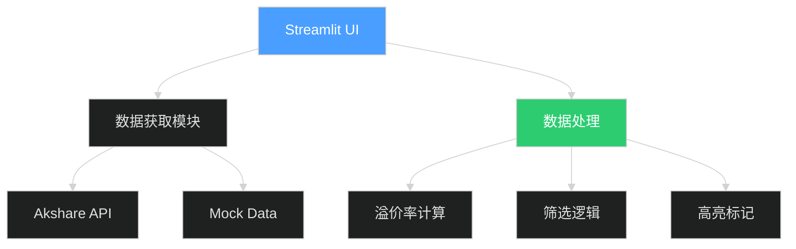

# LOF 基金套利监控系统 💰

一个基于 Streamlit 的 Web 应用程序，用于实时监控中国市场 LOF 基金的套利机会，特别适合"免五"用户寻找小额高溢价的"鸡腿"机会。

## ✨ 核心功能

### 1. 实时数据监控
- 获取 LOF 基金实时行情数据
- 自动计算溢价率：`(场内价格 - 基金净值) / 基金净值 × 100%`
- 监控申购状态和单日限额

### 2. 智能筛选
**默认筛选条件（可调整）：**
- 溢价率 > 1.5%
- 申购状态为"开放申购"或"限制大额申购"
- 场内成交额 > 50万元（避免流动性风险）

### 3. "鸡腿"机会高亮 🍗
**自动高亮显示符合以下条件的品种：**
- 单日限购金额：100 - 2000 元
- 溢价率 > 2%
- 红色背景标记，一目了然

### 4. 交互式参数调整
- 侧边栏动态调整筛选条件
- 一键刷新数据
- 数据导出为 CSV

## 🚀 快速开始

### 方式一：使用 Anaconda（推荐）

#### 1. 创建 Conda 虚拟环境

```bash
# 创建名为 lof_jt 的 Python 3.10 环境
conda create -n lof_jt python=3.10 -y

# 激活环境
conda activate lof_jt
```

#### 2. 安装依赖

```bash
# 进入项目目录
cd d:\code\my\1\lof_jt

# 安装依赖包
pip install -r requirements.txt
```

**依赖包说明：**
- `streamlit`: Web 应用框架
- `pandas`: 数据处理
- `numpy`: 数值计算
- `akshare`: 金融数据接口（开源免费）

#### 3. 运行程序

```bash
# 确保已激活 lof_jt 环境
conda activate lof_jt

# 运行应用
streamlit run app.py
```

#### 4. 环境管理命令

```bash
# 查看所有 Conda 环境
conda env list

# 停用当前环境
conda deactivate

# 删除环境（如需重建）
conda remove -n lof_jt --all -y
```

---

### 方式二：直接使用 Pip

#### 1. 安装依赖

```bash
pip install -r requirements.txt
```

#### 2. 运行程序

```bash
streamlit run app.py
```

程序会自动在浏览器打开，默认地址：`http://localhost:8501`

### 3. 使用说明

1. **调整筛选参数**：在左侧边栏设置溢价率和成交额阈值
2. **查看机会列表**：红色高亮的是"鸡腿"机会
3. **刷新数据**：点击"🔄 刷新数据"按钮获取最新行情
4. **导出数据**：点击"📥 导出为 CSV"保存数据

## 📊 套利原理


**举例说明：**
1. 某 LOF 基金净值 1.000 元，场内价格 1.025 元，溢价率 2.5%
2. 场外申购 1000 元（按净值），获得 1000 份
3. T+2 确认后，场内卖出 1000 份 × 1.025 = 1025 元
4. 收益：1025 - 1000 = 25 元（假设免五，成本极低）

## 🎯 适用人群

- ✅ 证券账户"免五"用户（无最低5元佣金限制）
- ✅ 喜欢积少成多的稳健投资者
- ✅ 有时间监控市场的投资者
- ✅ 熟悉 LOF 基金交易规则

## ⚠️ 风险提示

1. **T+2 风险**：申购确认需要 2 个交易日，期间溢价可能消失
2. **流动性风险**：场内成交量小可能卖不出去
3. **手续费**：虽然"免五"，但仍有印花税和过户费
4. **限购风险**：单日限额可能导致无法大额套利

## 📝 数据说明

### 数据源
- **优先使用**：Akshare（开源金融数据库）
- **备用方案**：Mock 数据（用于测试和演示）

### 数据字段
| 字段 | 说明 |
|------|------|
| 基金代码 | LOF 基金代码（通常以 16 开头） |
| 基金名称 | 基金全称 |
| 场内价格 | 实时交易价格 |
| 基金净值 | 最新公布净值 |
| 实时估值 | 盘中估算净值 |
| 申购状态 | 开放/限制/暂停 |
| 单日限额 | 单日申购上限 |
| 场内成交额 | 当日成交金额 |
| 溢价率 | 自动计算 |

## 🔧 技术架构



## 📦 项目结构

```
lof_jt/
├── app.py              # 主程序
├── requirements.txt    # 依赖清单
└── README.md          # 说明文档
```

## 🐛 故障排除

### 问题1：无法获取数据
**解决方案：**
1. 检查网络连接
2. 确认 akshare 安装成功：`pip show akshare`
3. 如果持续失败，程序会自动切换到 Mock 数据模式

### 问题2：Streamlit 无法启动
**解决方案：**
```bash
# 重新安装 streamlit
pip uninstall streamlit
pip install streamlit

# 检查端口占用
netstat -ano | findstr 8501
```

### 问题3：数据显示异常
**解决方案：**
- 点击"🔄 刷新数据"按钮
- 检查筛选参数是否过于严格
- 清除浏览器缓存

## 📈 未来优化计划

- [ ] 增加历史溢价率走势图
- [ ] 添加邮件/微信提醒功能
- [ ] 支持多个数据源切换
- [ ] 增加收益计算器
- [ ] 优化移动端显示

## 📄 许可证

本项目仅供学习和研究使用。

## 💬 联系方式

如有问题或建议，欢迎提 Issue！

---

**免责声明**：本系统仅供参考，不构成投资建议。投资有风险，入市需谨慎。
